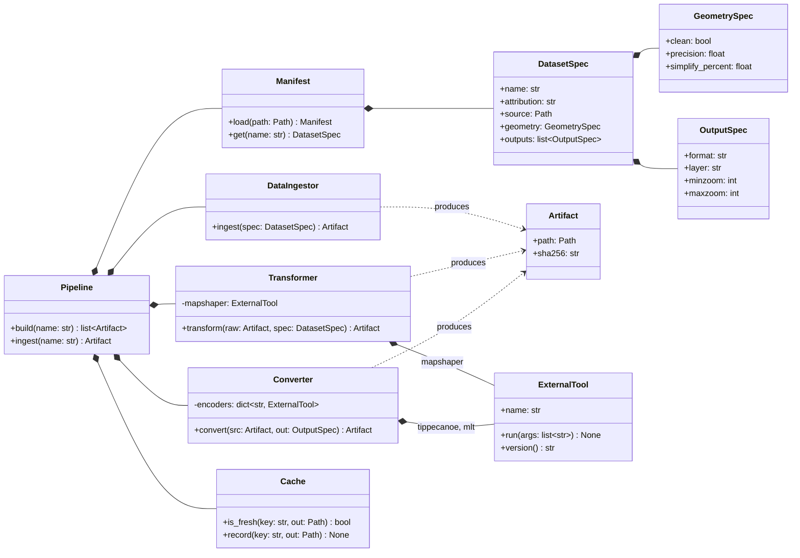
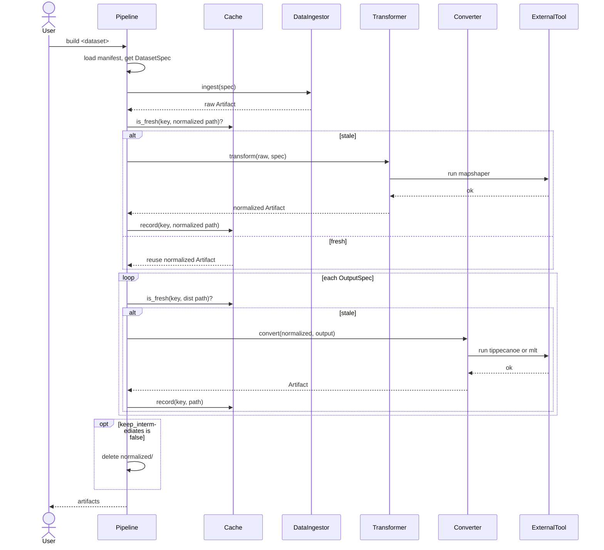

## Class Diagram

```mermaid
classDiagram
    direction LR

    class Pipeline {
        +build(name: str) list~Artifact~
        +ingest(name: str) Artifact
    }

    class Manifest {
        +load(path: Path) Manifest
        +get(name: str) DatasetSpec
    }

    class DatasetSpec {
        +name: str
        +attribution: str
        +source: Path
        +geometry: GeometrySpec
        +outputs: list~OutputSpec~
    }

    class GeometrySpec {
        +clean: bool
        +precision: float
        +simplify_percent: float
    }

    class OutputSpec {
        +format: str
        +layer: str
        +minzoom: int
        +maxzoom: int
    }

    class Artifact {
        +path: Path
        +sha256: str
    }

    class DataIngestor {
        +ingest(spec: DatasetSpec) Artifact
    }

    class Transformer {
        -mapshaper: ExternalTool
        +transform(raw: Artifact, spec: DatasetSpec) Artifact
    }

    class Converter {
        -encoders: dict~str, ExternalTool~
        +convert(src: Artifact, out: OutputSpec) Artifact
    }

    class ExternalTool {
        +name: str
        +run(args: list~str~) None
        +version() str
    }

    class Cache {
        +is_fresh(key: str, out: Path) bool
        +record(key: str, out: Path) None
    }

    Pipeline *-- Manifest
    Pipeline *-- DataIngestor
    Pipeline *-- Transformer
    Pipeline *-- Converter
    Pipeline *-- Cache

    Manifest *-- DatasetSpec
    DatasetSpec *-- GeometrySpec
    DatasetSpec *-- OutputSpec

    Transformer *-- ExternalTool : mapshaper
    Converter *-- ExternalTool : tippecanoe, mlt

    DataIngestor ..> Artifact : produces
    Transformer ..> Artifact : produces
    Converter ..> Artifact : produces
```

## Sequence Diagram

```mermaid
sequenceDiagram
    actor User
    participant CLI as Pipeline
    participant Cache
    participant Ingest as DataIngestor
    participant Trans as Transformer
    participant Conv as Converter
    participant Tool as ExternalTool

    User->>CLI: build <dataset>
    CLI->>CLI: load manifest, get DatasetSpec

    CLI->>Ingest: ingest(spec)
    Ingest-->>CLI: raw Artifact

    CLI->>Cache: is_fresh(key, normalized path)?
    alt stale
        CLI->>Trans: transform(raw, spec)
        Trans->>Tool: run mapshaper
        Tool-->>Trans: ok
        Trans-->>CLI: normalized Artifact
        CLI->>Cache: record(key, normalized path)
    else fresh
        Cache-->>CLI: reuse normalized Artifact
    end

    loop each OutputSpec
        CLI->>Cache: is_fresh(key, dist path)?
        alt stale
            CLI->>Conv: convert(normalized, output)
            Conv->>Tool: run tippecanoe or mlt
            Tool-->>Conv: ok
            Conv-->>CLI: Artifact
            CLI->>Cache: record(key, path)
        end
    end

    opt keep_intermediates is false
        CLI->>CLI: delete normalized/
    end

    CLI-->>User: artifacts
```